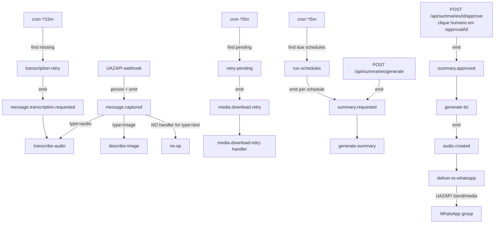

# Inngest events + workers

Arquivos-fonte:
- [`inngest/client.ts`](../../inngest/client.ts) — instance singleton
- [`inngest/events.ts`](../../inngest/events.ts) — typed event registry
- [`inngest/functions/*.ts`](../../inngest/functions/) — 10 workers

Relacionado: [`docs/integrations/inngest.md`](../integrations/inngest.md) (setup dev + prod, dashboard, troubleshooting — **leia primeiro** se você está configurando ambiente). Este doc foca em **eventos, contratos e handlers** internos.

## Evento ↔ handler table

| Evento | Emissor | Handler(s) | Output / side-effect |
|---|---|---|---|
| `message.captured` | `lib/webhooks/persist.ts:424` após INSERT em `messages` | `transcribe-audio.ts` (se `type==='audio'`)<br>`describe-image.ts` (se `type==='image'`) | INSERT em `transcripts`; updates de `media_download_status` |
| `message.transcription.requested` | Admin tooling manual | `transcription-retry.ts` | Re-runs transcription (aceita `force: true`) |
| `media.download.retry` | `retry-pending.ts` cron | `media-download-retry.ts` | `downloadAndStore` chamado; updates em `messages` |
| `summary.requested` | `POST /api/summaries/generate`<br>`run-schedules.ts` (cron)<br>`POST /api/summaries/[id]/regenerate` | `generate-summary.ts` | INSERT em `summaries` status `pending_review` |
| `summary.approved` | `POST /api/summaries/[id]/approve` (humano via UI) | `generate-tts.ts` | INSERT em `audios` + upload WAV no bucket `audios` |
| `audio.created` | `generate-tts.ts` após INSERT em `audios` | `deliver-to-whatsapp.ts` | UAZAPI `/send/media` + update `delivered_to_whatsapp`/`delivered_at` |
| `test.ping` | Smoke tests | `ping.ts` | No-op; confirma worker runtime up |
| `(cron */5m)` | Inngest schedule | `retry-pending.ts` | Para cada `messages.media_download_status='pending'` TTL-expired → emit `media.download.retry` |
| `(cron */5m)` | Inngest schedule | `run-schedules.ts` | Para cada `schedules` com fixed_time na janela → emit `summary.requested` |
| `(cron */15m)` | Inngest schedule | `transcription-retry.ts` | Para cada áudio/imagem sem transcript → emit `message.transcription.requested` |

## Fluxo end-to-end (event choreography)



## Naming convention

**`subject.action[.modifier]`** — dot-separated, lowercase, case-sensitive.

Subjects em uso: `message`, `media`, `summary`, `audio`, `test`.
Actions: `captured`, `requested`, `retry`, `approved`, `created`, `ping`.
Modifier (opcional): `message.transcription.requested` (subject `message`, action `transcription`, modifier `requested`).

Armadilha comum: **case-sensitive e dot-separated**. `Message.Captured`, `message_captured`, `message:captured` NÃO vão disparar o handler registrado como `message.captured`.

## Event type registry (`inngest/events.ts`)

Cada evento é declarado com `eventType(name, { schema: staticSchema<T>() })` — Inngest 4.x pattern. Mesmo objeto é usado de ambos os lados:

```ts
// Declaração
export const messageCaptured = eventType("message.captured", {
  schema: staticSchema<{ messageId: string; tenantId: string; type: "text"|"audio"|"image"|"video"|"other" }>(),
});

// Emit (com type-check na data)
await inngest.send(messageCaptured.create({ messageId, tenantId, type }));

// Handle
inngest.createFunction({ id, retries }, { triggers: [messageCaptured] }, async ({ event, step }) => { ... });
```

`staticSchema<T>` é **types-only** — não valida runtime. Aceitável porque todos emitters são internos; não é endpoint público. Se expandir pra receber events de fonte externa, trocar por `zodSchema`.

## Payload design discipline

**Payloads são IDs-only.** Nenhum dado de domínio (texto do summary, bytes do áudio, dados do user) viaja no evento. Handler sempre re-fetch do DB via ID (`inngest/events.ts:25-27, 112-115, 128-131`).

Por que:
1. Anti-drift — se row muda entre emit e handle, handler vê a versão fresca.
2. PII — Inngest loga payloads. Minimizar dado sensível em debug storage.
3. Retry determinista — a "verdade" é o DB, não a event envelope.

## Failure modes + retries

Cada `inngest.createFunction({ id, retries })`:

| Worker | `retries` | Política de falha |
|---|---|---|
| `transcribe-audio` | 3 (default) | Backoff exponencial; falha final = sem transcript, cron `transcription-retry` pega depois |
| `describe-image` | 3 | Idem; Gemini safety block = falha determinística, handler marca e não re-agenda |
| `generate-summary` | 2 | Backoff; falha final vira log (débito: alertar) |
| `generate-tts` | 2 | Retry em TTS transiente; `ALREADY_EXISTS` em retry é idempotência OK |
| `deliver-to-whatsapp` | 3 | Transient UAZAPI errors; idempotência via `delivered_to_whatsapp` check |
| `retry-pending` / `run-schedules` / `transcription-retry` | 1 | Handler já idempotente; uma retry como safety net |
| `media-download-retry` | 0-3 | `downloadAndStore` é best-effort, não throws — Inngest raramente re-tenta |

**Dead letter**: Inngest Cloud tem DLQ UI. Failures terminais ficam lá inspecionáveis. Em dev (Inngest local), dashboard em `http://127.0.0.1:8288` mostra eventos + runs com stack traces.

## Step wrapping discipline

Cada fase pesada é wrapped em `step.run('name', async () => …)`. Isso faz Inngest durable-checkpoint entre steps — uma falha de rede no step 4 não re-executa o step 1. Crítico pra workers que envolvem custo (Gemini call não pode re-rodar à toa).

Handler exportado **separado** de `inngest.createFunction(...)` (padrão em quase todos) pra permitir unit testing com fake `step`:

```ts
const fakeStep = { run: <T>(_n: string, fn: () => Promise<T>) => fn() };
await transcribeAudioHandler({ event: { data: {...} }, step: fakeStep });
```

## Crons

Declarados via `triggers: [{ cron: "*/5 * * * *" }]`. Todos em **UTC** (Inngest default). Tenant-facing timezone (ex: `run-schedules` em `America/Sao_Paulo`) é resolvido **dentro** do handler, não no cron expression.

**Importante**: crons **não disparam em dev local** com Inngest dev server. Invocar manualmente no dashboard (`Invoke` button). Em Inngest Cloud (prod) rodam normalmente.

## Dev setup

Ver [`docs/integrations/inngest.md`](../integrations/inngest.md) pra procedimento completo. Resumo:

```bash
# .env.local
INNGEST_DEV=1

# Terminal 1
npm run dev            # Next.js na :3001

# Terminal 2
npx inngest-cli@latest dev -u http://localhost:3001/api/inngest
# Dashboard: http://127.0.0.1:8288
```

Prod: `INNGEST_EVENT_KEY` + `INNGEST_SIGNING_KEY` como env vars na stack Portainer.

## Registro no route handler

Nova function não vai rodar sem ser adicionada a `app/api/inngest/route.ts` — esse é o handler que Inngest chama pra listar funções disponíveis. Esquecer disso = evento emitido e nunca processado.

## Gotchas

1. **Case sensitivity.** `Message.Captured ≠ message.captured`.
2. **Crons só em prod.** Use dashboard dev pra invocar à mão.
3. **IDs-only nos payloads.** Se você precisa passar "muita coisa", algo está errado — passe só ID e re-fetch.
4. **`step.run` names devem ser estáveis.** Mudar nome = Inngest trata como step novo = pode re-executar steps anteriores em runs em voo. Renomear só em deploy sem runs pendentes.
5. **`inngest.send()` com `void`.** `lib/webhooks/persist.ts:424` usa `void inngest.send(...).catch(...)` pra não bloquear o webhook. Trade-off: falha no emit = row persistida mas nunca processada. Mitigação: `transcription-retry` cron varre e pega depois.
6. **Registro no serve handler.** `app/api/inngest/route.ts` **tem que listar** cada function exportada — esquecer = handler silencioso.

## Testes

Cobertura de eventos + workers:
- `tests/transcribe-audio.spec.ts`
- `tests/describe-image.spec.ts`
- `tests/summary-generator.spec.ts`
- `tests/retry-workers.spec.ts` (cobre `retry-pending`, `media-download-retry`, `transcription-retry`)
- `tests/run-schedules.spec.ts`
- `tests/delivery-service.spec.ts` (service layer de `deliver-to-whatsapp`)

Padrão: mockar `inngest.send` + `createAdminClient()` + cliente externo (Groq/Gemini/UAZAPI) e exercitar o handler real com um fake `step`.
